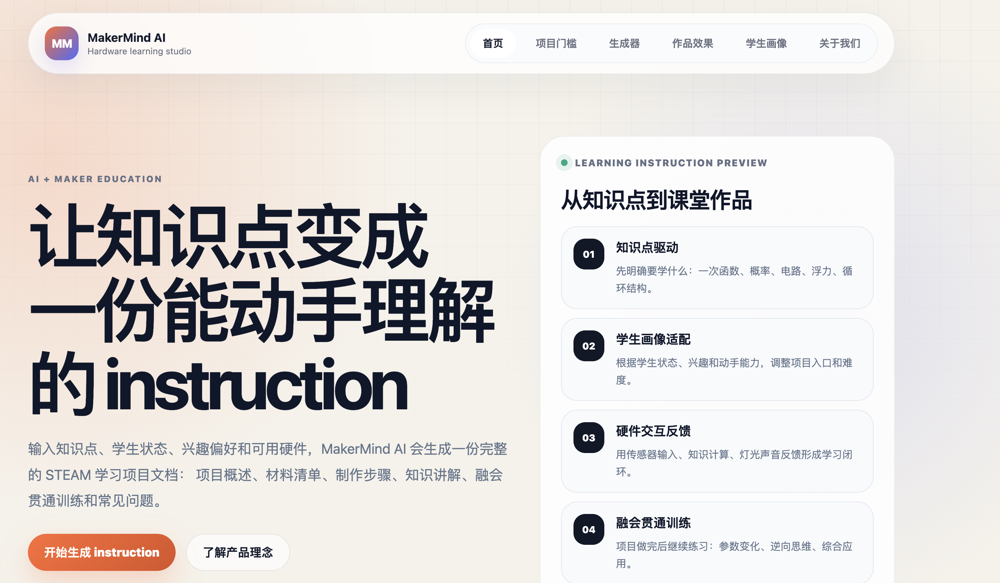
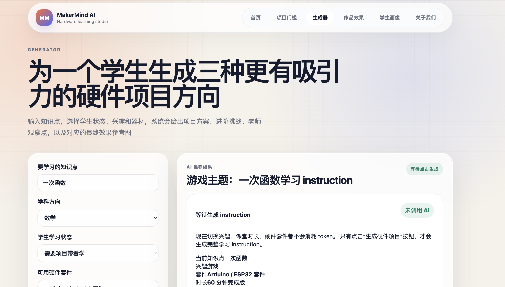

# MakerMind AI

> AI-powered STEAM instruction generator that turns knowledge points into hands-on hardware learning projects.

MakerMind AI is a web-based learning tool for maker education.
It helps teachers and students transform abstract knowledge points into complete STEAM project instructions, including project overview, interaction flow, materials, building steps, knowledge explanation, practice tasks, FAQ, and starter code.

Live Demo: https://makermind-ai.makermind-studio.workers.dev

---

## Preview

### Homepage



### Generator



### Generated Instruction


---

## Project Overview

Many project-based learning activities look creative, but students may only remember the final product instead of truly understanding the knowledge behind it.

MakerMind AI focuses on one core idea:

> The goal is not just to make a project.
> The goal is to help students understand a knowledge point through a project.

Instead of generating simple project ideas, MakerMind AI generates a complete learning instruction that connects:

* knowledge points
* student profiles
* interest preferences
* available hardware kits
* classroom time
* hands-on practice
* reflection and transfer tasks

---

## Core Features

### Knowledge-driven generation

Teachers enter a knowledge point, such as:

* linear functions
* probability
* circuits
* buoyancy
* programming loops

The system generates a hands-on STEAM learning project around that concept.

### Student profile adaptation

The generator considers the student's learning status and interests, such as:

* needs project-based guidance
* enjoys games
* enjoys pets
* enjoys music
* prefers hands-on challenges

### Hardware-aware project design

The instruction can adapt to different hardware kits, such as:

* Arduino / ESP32
* micro:bit
* paper circuits
* mixed maker materials
* UNIHIKER K10

### Full learning instruction

Each generated result includes:

* project overview
* interaction flow
* materials list
* step-by-step building guide
* knowledge explanation
* practice and transfer tasks
* extension challenges
* FAQ
* starter code

### Segmented AI generation

To improve stability, the instruction is generated in three parts:

1. Overview, interaction flow, and materials
2. Building steps, knowledge explanation, and starter code
3. Practice tasks, extensions, and FAQ

### Dual-language starter code

The generated instruction provides two starter code styles:

* C++ / Arduino
* MicroPython / K10

Each code block supports one-click copy.

---

## How It Works

```text
Teacher input
↓
Knowledge point + student profile + interest + hardware kit
↓
AI segmented generation
↓
Overview + build guide + practice tasks
↓
Frontend merges the result
↓
Complete STEAM learning instruction
```

---

## Tech Stack

* HTML
* CSS
* JavaScript
* Cloudflare Workers
* Cloudflare Static Assets
* AI text generation API
* GitHub

---

## Project Structure

```text
.
├── src/
│   └── index.js              # Cloudflare Worker backend and AI generation logic
├── public/
│   ├── index.html            # Homepage
│   ├── generator.html        # AI generator page
│   ├── gallery.html          # Project effect gallery
│   ├── students.html         # Student profile page
│   ├── rules.html            # Project design rules
│   ├── about.html            # Product philosophy page
│   ├── app.js                # Frontend generator logic
│   ├── styles.css            # Global styles
│   └── assets/
│       ├── readme/           # README screenshots
│       └── reference/        # Fixed reference images
└── README.md
```

---

## Local Development

Clone the repository:

```bash
git clone https://github.com/Dunphil692/makermind-ai.git
cd makermind-ai
```

Install dependencies:

```bash
npm install
```

Run locally with Cloudflare Wrangler:

```bash
npx wrangler dev
```

---

## Environment Variables

The AI generation backend requires the following environment variables:

```text
AI_API_KEY
AI_BASE_URL
AI_MODEL
```

The current version does not require real-time image generation.
Project images are displayed using fixed reference images stored in the project.

---

## Current Status

Completed:

* Homepage
* AI generator page
* Gallery page
* Student profile page
* Project rules page
* About page
* Segmented AI instruction generation
* Dual-language starter code blocks
* Copy button for starter code
* Fixed reference image system
* Custom favicon
* GitHub project screenshots

In progress:

* More stable JSON repair logic
* Better demo fallback instruction
* Improved homepage guide-style layout
* Better non-technical error messages
* Custom domain setup

---

## Roadmap

Planned improvements:

* Add a static example instruction for demo fallback
* Add “copy full instruction” button
* Add export to HTML / PDF
* Save generated instruction history
* Support more hardware kits
* Add teacher observation points
* Add more student profile templates
* Improve classroom-ready instruction formatting

---

## Project Vision

MakerMind AI is designed for AI + maker education.

It helps teachers transform abstract knowledge into something students can see, touch, test, and explain.

The final goal is to make project-based learning more personal, more practical, and more connected to real understanding.
